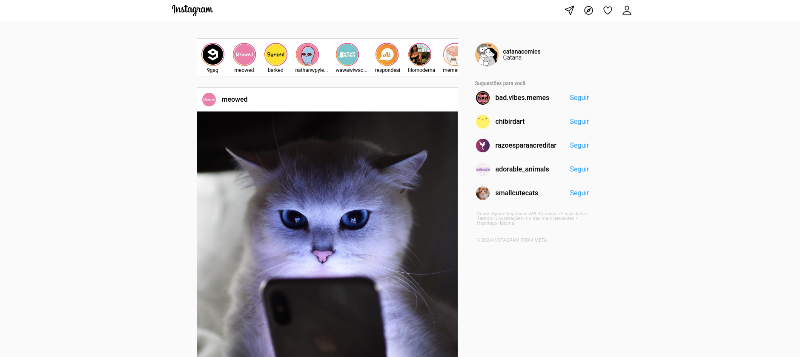
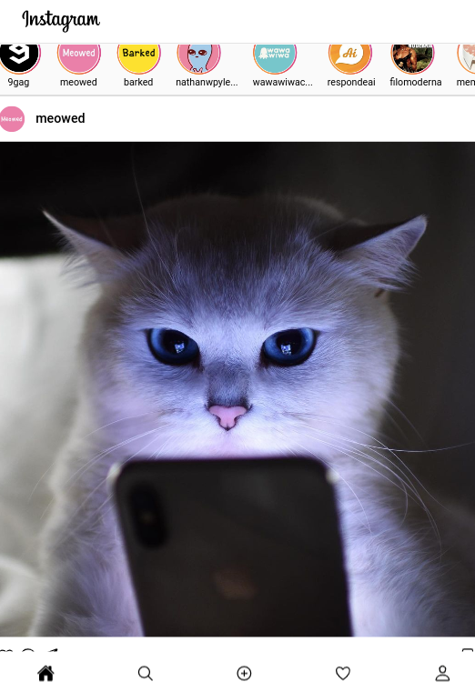

# Instagram Clone

Este é um clone simplificado do Instagram, criado usando HTML e CSS. O objetivo deste projeto é reproduzir a interface e a experiência do usuário do Instagram de forma básica, focando em layout e design.

## Funcionalidades

- Layout responsivo
- Estrutura básica semelhante à do Instagram
- Estilos simplificado da interface original

## Tecnologias Utilizadas

- **HTML5**: Para a estrutura do conteúdo.
- **CSS3**: Para o estilo e layout.

## Instalação

Para visualizar o projeto localmente, siga os passos abaixo:

1. **Clone o repositório**:
   ```bash
   git clone https://github.com/YureNathan/instagram.git
## Capturas de Tela
- Versão Desktop

- Versão Moblie


